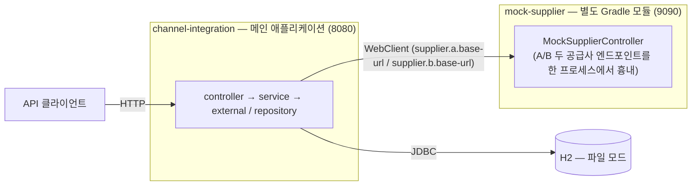
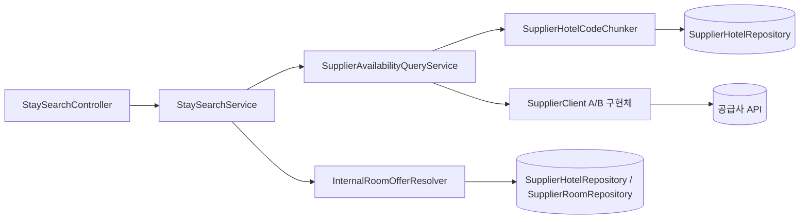
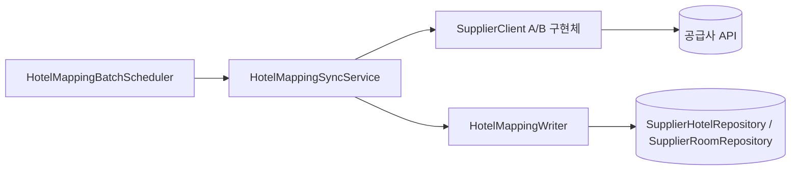

# 아키텍처

전체 구조, 패키지 구조와 호출 방향, 그리고 이 프로젝트에 실제로 존재하는 두 가지 호출 흐름(검색,
매핑 동기화)을 정리한다. 각 결정의 근거는 `README.md`(설계 의사결정)와 `domain-model.md`를
참고한다.

## 전체 구조

이 저장소는 Gradle 모듈 2개로 이루어져 있다 — 실제 서비스 코드인 `channel-integration`(루트
모듈)과, 공급사 A/B API를 흉내 내는 `mock-supplier`(하위 모듈)다. 둘은 완전히 분리된 프로세스로
각자 다른 포트(8080/9090)에서 뜬다.



- **DB 접근**: `channel-integration` 프로세스만 H2에 접근한다. `mock-supplier`는 DB를 전혀 모른다
  — 순수하게 고정된 JSON을 돌려주는 HTTP 서버일 뿐이다.
- **공급사 호출**: `external.a.SupplierAClient`/`external.b.SupplierBClient`는 각각
  `supplier.a.base-url`/`supplier.b.base-url` 설정값으로 호출 대상을 찾는다. 로컬 실행/테스트에서는
  둘 다 `http://localhost:9090`(`mock-supplier`)을 가리키도록 돼 있고, 실제 공급사 API가 있다면 이
  값만 바꾸면 된다 — `SupplierClient` 인터페이스로 감싸놓았기 때문에 그 위의 어떤 계층도 호출
  대상이 Mock인지 실제 공급사인지 알지 못한다.

### 왜 `mock-supplier`를 별도 Gradle 모듈로 뒀는가

같은 모듈 안에 실행 클래스만 하나 더 두는 방법(`MockSupplierApplication`을 `main` 소스셋에 같이
두는 방식)도 가능했지만, 그러면 컴포넌트 스캔 범위가 겹쳐 Mock의 컨트롤러가 실제 앱 기동 시
같이 스캔될 위험이 있다. 별도 모듈로 분리하면 컴파일 경계와 클래스패스 자체가 나뉘어 그 위험이
원천적으로 없어지고, `:mock-supplier:bootRun`으로 독립적으로 띄울 수 있어 로컬에서 두 프로세스를
따로 실행하기도 쉽다.

부수적인 이점 하나 — 통합 테스트가 `testImplementation project(':mock-supplier')`로 이 모듈을 그대로
의존성에 추가해, 테스트 시작 시 Mock을 코드로 직접 기동한다(`MockSupplierSupport`). 별도 Mock
서버를 미리 띄워두지 않아도 `./gradlew test` 하나로 전체 테스트가 자체 완결된다.

## 패키지 구조와 의존 방향

아래는 `channel-integration`(메인 애플리케이션) 내부 패키지 구조다. `mock-supplier`는
`com.server.channel.mocksupplier` 아래에 `controller`(Mock 컨트롤러)만 있는 훨씬 단순한 구조라
별도로 다루지 않는다.

```
com.server.channel
├── batch          (스케줄러 — 기동/주기 트리거)
├── controller      (HTTP 진입점)
├── exception       (HTTP 경계의 전역 예외 처리)
├── service         (유스케이스 오케스트레이션)
│   ├── chunker     (숙소 코드를 공급사 API 제약에 맞춰 청크 분할)
│   ├── writer      (매핑 upsert — DB 쓰기 트랜잭션 경계)
│   ├── resolver    (공급사 코드 기준 식별자 → 내부 식별자 변환)
│   └── dto         (계층 사이를 오가는 값 타입)
├── external        (공급사 API 어댑터: SupplierClient 인터페이스 + A/B 구현체)
│   ├── a, b        (공급사별 구현체 + 그 공급사 전용 dto)
│   ├── config      (공급사별 WebClient 빈, 타임아웃 설정)
│   ├── dto         (공급사 차이를 흡수한 표준 요청/응답)
│   └── exception   (공급사 실패를 통일한 예외)
├── domain          (JPA 엔티티)
└── repository      (Spring Data JPA)
```

의존 방향은 한쪽으로만 흐른다 — 역참조는 없다.

- `controller`, `batch`는 오직 `service`만 안다.
- `exception`은 `controller`가 발생시킨 예외를 가로채는 경계라, `controller`와 같은 층위에 있지만
  `controller`가 이 패키지를 알지는 못한다(`@RestControllerAdvice`가 전역으로 등록될 뿐 컨트롤러
  코드에서 직접 참조하지 않는다).
- `service`(오케스트레이션)는 `chunker`/`writer`/`resolver`와 `external`을 호출한다.
- `chunker`/`writer`/`resolver`는 `repository`를 호출한다.
- `domain`은 어디서도 다른 패키지를 참조하지 않는다. 모든 계층이 타입으로 `domain`을 참조할 수는
  있다.

## 호출 흐름 1 — 검색 (`GET /api/v1/stays/search`)



1. `StaySearchController`가 쿼리 파라미터로 `AvailabilityQueryRequest`를 만든다(체크아웃이
   체크인보다 앞서면 이 시점에 예외 발생).
2. `StaySearchService`가 `SupplierAvailabilityQueryService`를 호출해 공급사 원본 응답
   (`AvailabilityQueryResponse`)을 얻는다.
   - `SupplierAvailabilityQueryService`는 먼저 `SupplierHotelCodeChunker`로 DB에 저장된 숙소
     코드를 50개 단위 청크로 나누고, 청크 × 공급사 조합마다 `SupplierClient`(A/B 구현체)를
     병렬로 호출한다.
   - 공급사 하나가 실패해도 나머지 결과는 살아남고, 실패한 공급사는 `failedSuppliers`에 기록된다
     (부분 실패, HTTP 상태는 여전히 200).
3. `StaySearchService`는 이 원본 응답을 `InternalRoomOfferResolver`에 넘겨, 공급사 코드 기준
   식별자를 내부 `hotelId`/`roomId`로 변환하고 연박 기간의 예약 가능 객실 수(최솟값)를 계산한다.
4. 변환 결과(`StaySearchResponse`)를 컨트롤러가 그대로 클라이언트에 반환한다.

## 호출 흐름 2 — 매핑 동기화 (기동 시 1회 + 주기적)



1. `HotelMappingBatchScheduler`가 `@Scheduled(initialDelay = 0, fixedDelayString = ...)`로 앱
   기동 시 1회, 이후 설정된 주기마다 실행된다.
2. `HotelMappingSyncService`가 공급사별로 `SupplierClient.getHotels()`를 호출해 숙소 목록을
   받아온다 — 이 호출은 외부 HTTP라 트랜잭션 밖에서 이루어진다.
3. 공급사 하나씩 받은 응답을 `HotelMappingWriter.write(code, response)`에 넘긴다.
   `HotelMappingWriter`는 `@Transactional` 경계 안에서 DB에 upsert만 수행한다.
4. 외부 호출(`HotelMappingSyncService`)과 DB 쓰기(`HotelMappingWriter`)를 서로 다른 빈으로 분리한
   이유: 같은 트랜잭션 안에 외부 HTTP 호출이 섞이면 (1) 응답이 느릴수록 DB 커넥션을 그만큼 오래
   붙잡고, (2) 한 공급사의 실패가 이미 끝난 다른 공급사의 DB 반영까지 함께 롤백시킬 수 있다.
5. 공급사 하나가 실패(`SupplierUnavailableException`)해도 나머지 공급사의 동기화는 계속 진행된다
   (공급사별 실패 격리, `HotelMappingSyncService`의 루프 안에서 try-catch로 처리).

## 계층별 책임

| 패키지               | 책임                                                    | 호출하는 곳                | 호출받는 곳            |
|-----------------------|---------------------------------------------------------|-----------------------------|--------------------------|
| `controller`          | HTTP 요청/응답, 파라미터 바인딩                          | `service`                   | (진입점)                 |
| `exception`           | HTTP 경계에서 발생한 예외를 응답 형식으로 변환            | (없음)                      | (프레임워크가 전역 등록)  |
| `batch`               | 스케줄 트리거                                            | `service`                   | (진입점)                 |
| `service`             | 유스케이스 오케스트레이션                                | `chunker`/`writer`/`resolver`, `external` | `controller`, `batch` |
| `service.chunker`     | 저장된 숙소 코드를 공급사 API 제약(50개)에 맞춰 분할     | `repository`                | `service`                |
| `service.writer`      | 매핑 upsert, DB 쓰기 트랜잭션 경계                       | `repository`                | `service`                |
| `service.resolver`    | 공급사 코드 기준 식별자 → 내부 식별자 변환               | `repository`                | `service`                |
| `external`            | 공급사별 API 호출 + 실패 판정 통일                       | (외부 HTTP)                 | `service`                |
| `domain`              | JPA 엔티티                                               | (없음)                      | 모든 계층이 타입으로 참조 |
| `repository`          | Spring Data JPA                                          | (없음, DB)                  | `chunker`/`writer`/`resolver` |

## 실패 판정을 어댑터 경계에서 통일하는 이유

공급사 A는 HTTP 상태 코드(4xx/5xx)로 실패를 알리고, 공급사 B는 항상 `200`을 반환하면서 응답
본문의 결과 코드로만 실패를 구분한다. 이 차이를 그대로 위 계층까지 흘려보내면 `service` 쪽이
공급사마다 분기 처리를 해야 한다. 그래서 `external.a`/`external.b` 어댑터 내부에서 두 방식을 모두
`SupplierUnavailableException` 하나로 통일해 던지고, `service`부터는 공급사가 어떤 방식으로
실패를 알렸는지 신경 쓰지 않는다. 타임아웃(연결 1초/응답 4초)도 같은 예외로 통일해, 어댑터 위에서
보면 "공급사 실패"는 항상 한 가지 형태로만 보인다.
