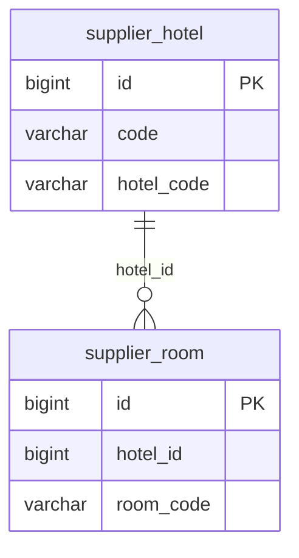

# 도메인 모델

이 프로젝트가 DB에 저장하는 것은 "공급사 코드 ↔ 내부 식별자" 매핑 두 개뿐이다. 요금·재고는
원본이 항상 공급사에 있으므로 저장하지 않고, 검색 시점에 매번 라이브로 조회한다.

## 왜 이것만 저장하는가

"같은 공급사 상품을 조회하면 항상 같은 내부 식별자가 나와야 한다"는 요구사항이 이 모델의 핵심
제약이다. 이걸 지키려면 (공급사, 공급사 코드) 조합과 내부 식별자를 잇는 매핑만 있으면 충분하고,
숙소명/객실명/가격처럼 자주 바뀌거나 다른 곳에서 이미 얻을 수 있는 값을 매핑 테이블에 같이 들고
있을 이유가 없다.

숙소명·객실명은 재고·요금 조회 API 응답에 항상 함께 오기 때문에, 검색 결과를 만드는 시점에 그
응답에서 바로 가져다 쓰면 된다. 그래서 매핑 테이블에는 코드와 내부 식별자만 남긴다.

## 테이블

### `supplier_hotel`

공급사 하나의 숙소 코드 하나를 내부 `hotelId` 하나에 대응시킨다.

| 컬럼         | 타입    | 제약                  | 설명                          |
|--------------|---------|-----------------------|-------------------------------|
| `id`         | BIGINT  | PK, auto increment    | 내부 숙소 식별자 (`hotelId`)  |
| `code`       | VARCHAR | NOT NULL              | 공급사 코드 (`A` \| `B`)      |
| `hotel_code` | VARCHAR | NOT NULL              | 그 공급사가 매기는 숙소 코드  |

유니크 제약: `(code, hotel_code)` — 같은 공급사의 같은 숙소 코드는 행 하나로만 존재해야
"항상 같은 내부 식별자"가 보장된다.

### `supplier_room`

숙소 하나(내부 `hotelId`) 아래에 딸린 객실 코드 하나를 내부 `roomId` 하나에 대응시킨다.

| 컬럼        | 타입    | 제약                | 설명                                          |
|-------------|---------|---------------------|-----------------------------------------------|
| `id`        | BIGINT  | PK, auto increment  | 내부 객실 식별자 (`roomId`)                   |
| `hotel_id`  | BIGINT  | NOT NULL            | `supplier_hotel.id`를 가리키는 값 (순수 FK 컬럼) |
| `room_code` | VARCHAR | NOT NULL            | 그 숙소 안에서의 객실 코드                    |

유니크 제약: `(hotel_id, room_code)` — 같은 숙소 안에서 같은 객실 코드는 행 하나로만 존재해야 한다.
공급사 코드(`A`/`B`)가 컬럼에 없는 이유는, `hotel_id`가 이미 특정 공급사의 특정 숙소로 유일하게
정해지는 값이라 `supplier_room` 단계에서 공급사를 또 구분할 필요가 없기 때문이다.

## `@ManyToOne` 대신 순수 FK 컬럼을 쓴 이유

`SupplierRoom.hotelId`는 JPA 연관관계(`@ManyToOne`)가 아니라 그냥 `Long` 컬럼이다.
`supplier_hotel`을 먼저 조회하고 그 결과(`hotelId`)로 `supplier_room`을 조회하는 흐름 자체는
실제로 항상 일어난다(`HotelMappingWriter`, `InternalRoomOfferResolver` 둘 다 이 순서로 동작한다).
그럼에도 연관관계 매핑, 특히 즉시 로딩(EAGER)/fetch join은 이 흐름에서 실질적인 이득이 없다고
판단했다.

- **Hotel 쪽에서 join으로 새로 얻을 데이터가 없다.** `supplier_hotel`의 컬럼은 `id`, `code`,
  `hotel_code` 셋뿐인데, `code`/`hotel_code`는 애초에 Hotel을 조회할 때 검색 조건으로 이미 들고
  있던 값이다(`findByCodeAndHotelCodeIn(code, hotelCodes)`). join해서 얻는 건 결국 `id` 하나뿐이고,
  그건 지금도 조회 결과에서 그대로 꺼내 쓴다. `hotelName`처럼 join으로 얻을 법한 값은 이 엔티티에
  아예 없다 — DB에 저장하지 않고 재고·요금 조회 응답에서 그때그때 가져오기로 했기 때문이다.
- **Room 조회가 "한 Hotel의 Room 컬렉션"이 아니라 "여러 Hotel에 걸친 (hotelId, roomCode) 쌍
  매칭"이다.** `findByHotelIdInAndRoomCodeIn(hotelIds, roomCodes)`는 hotelId 여러 개와 roomCode
  여러 개를 각각 `IN`으로 걸어 정확한 쌍만 골라내는 벌크 조회다. `@OneToMany` fetch join은 "이
  Hotel 하나의 Room 전부"를 당겨올 때 유리하지만, 지금처럼 여러 Hotel에 걸쳐 특정 (hotelId,
  roomCode) 쌍만 골라내는 조회는 join으로 대체되지 않고 지금과 같은 커스텀 벌크 쿼리 +
  애플리케이션 레벨의 정밀 매칭이 어차피 그대로 필요하다.
- **쓰기 경로(`HotelMappingWriter`)에서는 오히려 손해다.** 새 `SupplierRoom`을 만드는 시점엔
  `SupplierHotel` 엔티티가 아니라 `Long hotelId` 값만 손에 있다(먼저 만든 `hotelIdByCode` 맵이
  `SupplierHotel::getId`만 남기고 엔티티 자체는 버린다). `@ManyToOne`이었다면 이 시점에 진짜
  `SupplierHotel` 참조가 필요해, 다시 조회하거나 `entityManager.getReference()`로 프록시를 만들어야
  했을 것이다 — 지금 쓰지 않는 `EntityManager` 의존성까지 끌어오는 순수 오버헤드다.
- **즉시 로딩은 "지금 이 두 접근 패턴"을 엔티티 레벨의 영구 규칙으로 박제하는 것이다.**
  `fetch = EAGER`는 클래스 전체에 거는 설정이라, 나중에 Room만 필요한 다른 용도가 생겨도 매번
  Hotel까지 딸려 온다. "항상 Hotel 먼저 조회한다"는 지금 두 서비스의 구현 방식이지 Room이라는
  개념 자체의 본질적 특성은 아니므로, 엔티티에 영구히 새겨두는 건 과한 결합이라고 봤다.

정리하면, join으로 아낄 수 있는 쿼리도 새로 얻는 데이터도 없고, 오히려 쓰기 경로에 불필요한 엔티티
참조 요구만 추가된다. 그래서 순수 FK 컬럼을 선택했다.

## 매핑이 채워지는 시점

애플리케이션 기동 시 1회, 이후 주기적으로(`@Scheduled(fixedDelay=...)`) 두 공급사의 숙소 목록 API를
호출해 위 두 테이블을 upsert한다. 이 동기화 흐름 자체에 대한 설계(외부 호출과 DB 쓰기 트랜잭션
분리, 공급사별 실패 격리 등)는 `architecture.md`에서 다룬다.

## 저장하지 않는 것

요금·재고는 DB에 두지 않는다. 검색 요청이 올 때마다 공급사 API를 그 자리에서 호출해 응답을
표준 모델(`InternalRoomOffer`)로 변환해 돌려준다. 표준 모델의 필드 정의와, "세금 포함 총액 하나로
통일" 같은 값 자체의 설계 근거는 `README.md`의 설계 의사결정 섹션에 있다.

## 공급사 간 병합은 하지 않는다

서로 다른 공급사가 같은 물리적 숙소를 팔더라도(예: A의 `A-10023`과 B의 `B77120`이 실제로는 같은
호텔), 이 모델은 그 둘을 하나의 내부 식별자로 합치지 않는다. 그 둘을 같은 숙소라고 판단할 공통
키가 API 스펙에 없고, 이름·객실 구성으로 추정해 병합하는 건 이번 구현 범위 밖이라고 판단해
포함하지 않았다. 지금은 공급사가 다르면 내부 식별자도 항상 별개로 발급된다.
